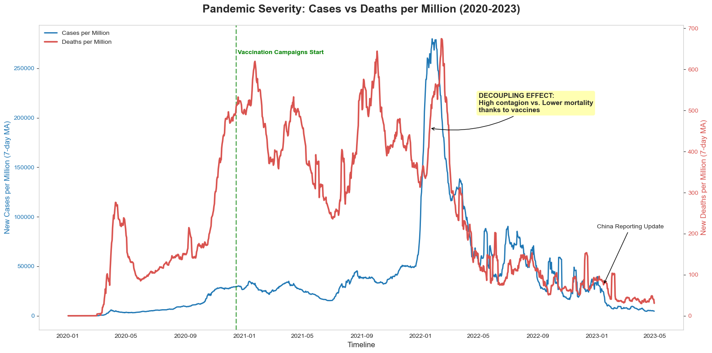
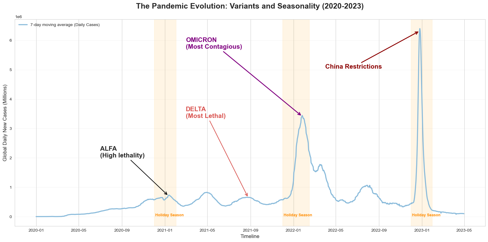
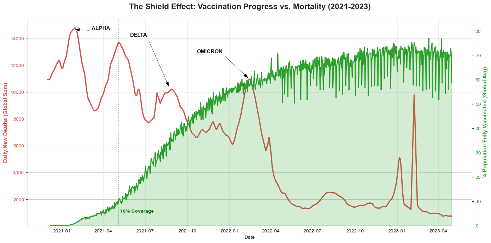
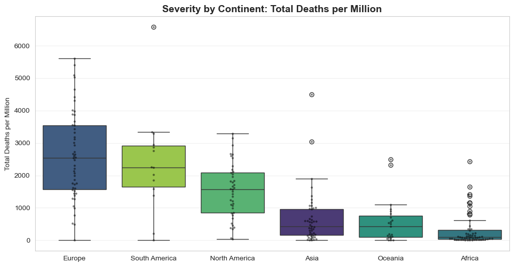
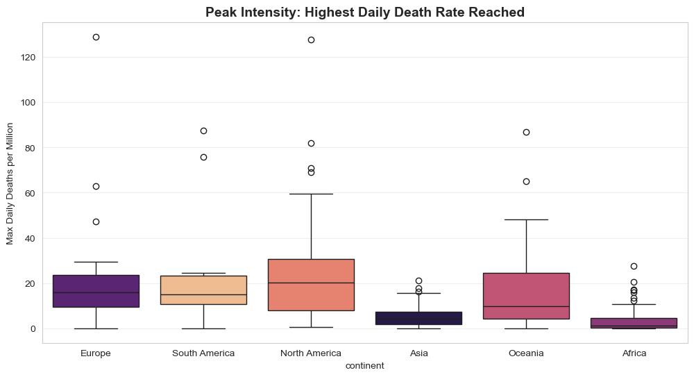
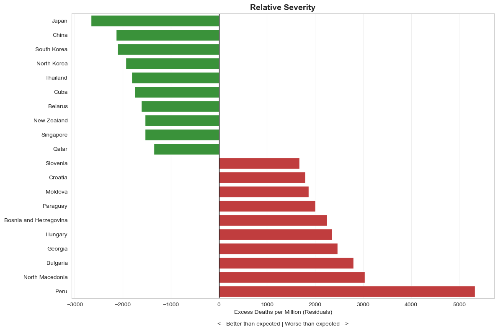
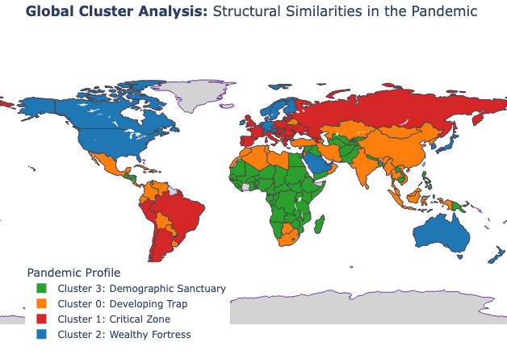

# COVID-19 Exploratory Data Analysis (EDA) Report

## 🎯 Executive Summary

This report synthesizes the analysis of the COVID-19 pandemic (2020-2023), covering temporal evolution, geographical impact, and structural clustering.

**Key Insights:**
1.  **The Decoupling Effect:** Vaccination campaigns successfully broke the correlation between cases and deaths in 2022.

2.  **The Wealth Paradox:** Wealthy nations reported higher mortality rates due to aging populations and better reporting systems.

3.  **Demographics is Destiny:** Median Age was the strongest predictor of mortality, creating a "Demographic Shield" for younger regions like Africa.

4.  **Structural Profiles:** We identified 4 distinct country profiles, ranging from "The Wealthy Fortress" to "The Developing Trap."

---

## 1. Temporal Analysis: The Three Phases
*Analysis of the pandemic's evolution over time.*

We identified three distinct phases defined by the interaction between the virus, policy, and science.

### Phase I: The Global Shock (2020)
The initial phase was characterized by a direct correlation between infections and mortality. As seen in the global evolution chart below, every spike in cases was followed by a proportional spike in deaths.

*Fig 1. Global Evolution: The correlation between Cases (Blue) and Deaths (Red) prior to 2022.*

### Phase II: The Arms Race & Seasonality (2021)
The virus evolved into more dangerous variants (**Alpha, Delta**). We identified a **strong seasonal component**: waves consistently peaked during Northern Hemisphere winters, driven by indoor gatherings. The colored bands below show how Delta dominated the mid-2021 period before the Omicron explosion.

*Fig 2. Seasonality and Variant Waves showing the recurring winter surges.*

### Phase III: The Shield Effect (2022-Onwards)
The turning point of the pandemic was the **"Decoupling Effect"**.
As seen in the chart below, while **Omicron** caused the highest infection rates in history (The Blue Mountain), the **Vaccination Shield** (Green Area) prevented a corresponding spike in deaths (Red Line).

*Fig 3. The Decoupling: How the Vaccination Shield suppressed mortality during the Omicron wave.*

---

## 2. Geographical Analysis: The Wealth Paradox
*Analysis of "Where" the pandemic hit the hardest.*

### Severity by Region
Contrary to popular belief, **Europe and South America** suffered the highest mortality rates.
* **Europe:** Struggled due to an aging population (Median Age ~42).
* **South America:** Struggled due to healthcare saturation and inequality.
* **Africa/Asia:** Showed the lowest mortality, protected by the **"Demographic Shield"** (Median Age ~19-25).

*Fig 4. Distribution of Total Deaths per Million by Continent.*

### Peak Intensity vs. Total Impact
When analyzing the "violence" of the waves (Max Daily Deaths), **North America** showed the highest peak intensity. This suggests their healthcare systems faced extreme stress tests during surges, even if their total cumulative deaths were lower than South America's in some regions.

*Fig 5. Peak Intensity: The maximum stress level reached by healthcare systems.*

---

## 3. Performance Analysis: Who did better than expected?

Raw death counts are unfair metrics because they ignore age. To find the true "Best Performers," we calculated the **Relative Severity** (Residuals), adjusting for Median Age.

* **Top Performers (Green):** Countries in **Asia and Oceania** (e.g., South Korea, New Zealand) saved more lives than their demographics predicted.
* **Worse Performers (Red):** Countries in **Eastern Europe and South America** (e.g., Peru, Bulgaria) suffered "excess deaths" beyond what their age structure would predict, indicating systemic failure.

*Fig 6. Relative Severity: Performance adjusted by Demographic Risk.*

---

## 4. Structural Clustering: The 4 Pandemic Profiles

Using Unsupervised Machine Learning (K-Means), we moved beyond geography to identify countries with similar structural behaviors. We found 4 archetypes:

1.  🔴 **Cluster 1: The Critical Zone (e.g., Eastern Europe)**
    * *Old Population + High Mortality.* Wealth could not offset the demographic risk.
2.  🔵 **Cluster 2: The Wealthy Fortress (e.g., Nordics, Australia)**
    * *Old Population + Low Mortality.* The success stories. High resources and strict measures protected their vulnerable demographics.
3.  🟠 **Cluster 0: The Developing Trap (e.g., Latin America)**
    * *Younger Population + High Mortality.* The most tragic group. Despite a demographic advantage, healthcare collapse led to catastrophe.
4.  🟢 **Cluster 3: The Demographic Sanctuary (e.g., Sub-Saharan Africa)**
    * *Youngest Population + Low Mortality.* Natural biological resilience due to extreme youth.

*Fig 7. Structural Clustering: Countries with similar behaviors.*

> 🗺️ **Interactive Experience:** [Click here to open the Interactive Map](../figures/maps/interactive_cluster_map.html) covering all countries and metrics.

---

## 5. Strategic Conclusions

1.  **Vulnerability Management:** Age is the primary risk factor. Future pandemic responses must prioritize shielding the elderly immediately, regardless of GDP.
2.  **Resource Allocation:** The "Developing Trap" cluster proved that youth is not enough if the health system collapses. International aid should target these regions to prevent high mortality peaks.
3.  **Data Transparency:** The "Wealth Paradox" is partly a "Data Paradox." Wealthy nations counted better. Standardized global reporting is essential for comparable insights in future pandemics.

---

## 6. Limitations & Future Improvements

To further refine this analysis and address potential biases, the following steps are recommended:

* **Excess Mortality Analysis:** To correct the "reporting bias" (where wealthy nations report more deaths), we should analyze **Excess Mortality** (deaths above the historical average) rather than reported COVID-19 deaths. This would reveal the true toll in under-reporting regions like Africa or India.
* **Sub-National Granularity:** Analyzing data at a regional/state level (e.g., USA States, EU Regions) would provide better insights into how specific local policies (lockdowns, mask mandates) influenced the spread, removing the noise of national averages.
* **Long-COVID Impact:** This study focused on acute mortality.